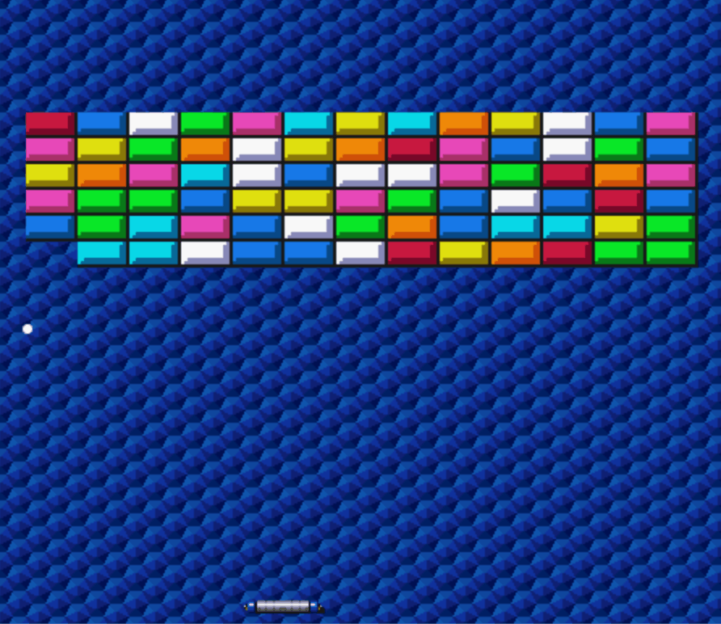

# 🧱 Arkanoid JS

  

  
  
  
  
  

  
  
  

---

🌐 **Play here:** https://alobuuls.github.io/arkanoid-game/

---

## 🎮 Description

Arkanoid game developed in JavaScript using Canvas. It features realistic collisions, keyboard controls, sounds, and a win animation.

---

## 📖 About the project

This project is a recreation of the classic **Arkanoid / Breakout** game, built with **vanilla JavaScript** and the **Canvas API**.

The player controls a paddle to bounce the ball and destroy all the bricks on the screen.

The game includes bounce physics, collision detection, a win system, sounds, and animations.

---

## ✨ Features

- Collisions with bricks, walls, and paddle  
- Angle-based ball rebound depending on the hit point  
- Random-colored bricks  
- Sound effects when breaking bricks, bouncing, winning, and losing  
- Animated win screen  
- Real-time FPS counter  
- Keyboard controls (arrow keys or A / D)

---

## 🕹 Controls

| Key | Action |
|-----|--------|
| ← / A | Move left |
| → / D | Move right |

---

## 🛠 Technologies

- HTML5  
- CSS3  
- JavaScript  
- Canvas API  

---

## 🎯 Goal

Practice programming logic, animations, collision detection, and event handling using JavaScript.