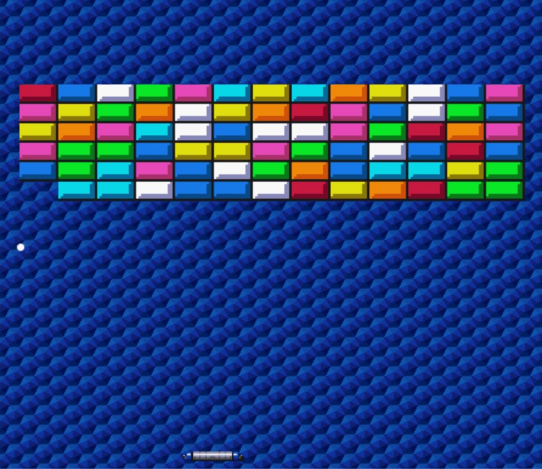

# 🧱 Arkanoid Game JS

<p align="center">
  
</p>

<p align="center">
  
  
  
  
  
</p>

<p align="center">
  <a href="https://github.com/alobuuls/arkanoid-game" target="_blank"></a>
  <a href="https://github.com/alobuuls/arkanoid-game/stargazers" target="_blank"></a>
  <a href="https://github.com/alobuuls/arkanoid-game/commits/main" target="_blank"></a>
</p>

---

## 📑 Table of Contents

* [🧱 Arkanoid Game JS](#-arkanoid-game-js)

  * [📑 Table of Contents](#-table-of-contents)

  * [🌐 Live Demo](#-live-demo)

  * [📖 Description](#-description)

  * [⚙️ System Requirements](#️-system-requirements)

  * [🔍 Verify Installation](#-verify-installation)

  * [🚀 Project Installation](#-project-installation)

    * [1️⃣ Clone the repository](#1️⃣-clone-the-repository)
    * [2️⃣ Open the project](#2️⃣-open-the-project)

  * [▶️ Run the Project](#️-run-the-project)

  * [🧠 Project Architecture](#-project-architecture)

    * [📦 Core Modules](#-core-modules)

      * [Game Engine](#game-engine)
      * [Collision System](#collision-system)
      * [Rendering Module](#rendering-module)
      * [Input Management](#input-management)

  * [✨ Features](#-features)

  * [🎮 Controls](#-controls)

  * [🛠 Technologies Used](#-technologies-used)

  * [📁 Project Structure](#-project-structure)

  * [🔥 Best Practices Implemented](#-best-practices-implemented)

  * [🎯 Project Goal](#-project-goal)

  * [📄 License](#-license)

---

## 🌐 Live Demo

🔗 https://alobuuls.github.io/arkanoid-game/

---

## 📖 Description

> [!NOTE]
> Arkanoid Game JS is a browser-based arcade game built with HTML, CSS, JavaScript, and the Canvas API.

The project recreates the classic Arkanoid / Breakout gameplay experience, where players control a paddle to keep the ball in play and destroy every brick on the screen. The game includes collision physics, sound effects, animations, and a complete win/lose system.

---

## ⚙️ System Requirements

Before running the project, make sure you have:

* 🌐 A modern web browser (Chrome, Firefox, Edge, Safari)
* 📦 Git (optional)

---

## 🔍 Verify Installation

Check that Git is installed:

```bash
git --version
```

---

## 🚀 Project Installation

### 1️⃣ Clone the repository

```bash
git clone git@github.com:alobuuls/arkanoid-game.git

cd arkanoid-game
```

### 2️⃣ Open the project

> [!IMPORTANT]
> No dependencies or package installation are required.

You can simply open:

```text
index.html
```

or run the project using Live Server in Visual Studio Code.

---

## ▶️ Run the Project

Open the `index.html` file directly in your browser.

---

## 🧠 Project Architecture

> [!NOTE]
> The game is built using Vanilla JavaScript and the Canvas API, following a real-time game loop architecture.

### 📦 Core Modules

#### Game Engine

Responsible for:

* Main game loop
* State updates
* Win/Lose conditions
* Frame management

#### Collision System

Handles:

* Ball-to-brick collisions
* Ball-to-wall collisions
* Ball-to-paddle interactions
* Bounce calculations

#### Rendering Module

Manages:

* Sprite rendering
* Background drawing
* Brick generation
* Canvas updates

#### Input Management

Controls:

* Keyboard input
* Paddle movement
* User interactions
* Gameplay responsiveness

---

## ✨ Features

* 🎮 Classic Arkanoid gameplay
* 🧱 Destructible brick system
* ⚡ Real-time collision detection
* 🎯 Angle-based ball rebounds
* 🌈 Random-colored bricks
* 🔊 Sound effects for gameplay events
* 🏆 Win and lose conditions
* 🎬 Animated victory screen
* 📊 Real-time FPS counter
* ⌨️ Keyboard controls
* 🚀 Lightweight implementation without frameworks

---

## 🎮 Controls

| Key   | Action     |
| ----- | ---------- |
| ← / A | Move Left  |
| → / D | Move Right |

---

## 🛠 Technologies Used

| Technology            | Purpose          |
| --------------------- | ---------------- |
| HTML5                 | Structure        |
| CSS3                  | Styling          |
| JavaScript (ES6+)     | Game Logic       |
| Canvas API            | Rendering Engine |
| requestAnimationFrame | Game Loop        |
| Keyboard Events       | Player Input     |
| Audio API             | Sound Effects    |

---

## 📁 Project Structure

```text
arkanoid-game/
├── index.html
├── main.js
├── styles.css
├── README.md
├── images/
│   ├── preview.gif
│   ├── bkg.png
│   ├── bricks.png
│   └── sprite.png
```

---

## 🔥 Best Practices Implemented

* Game loop architecture
* Separation of responsibilities
* Collision abstraction
* Sprite-based rendering
* Event-driven input handling
* Real-time state updates
* Canvas rendering optimization
* Reusable game logic
* Clean code organization
* Framework-free implementation

---

## 🎯 Project Goal

Practice and strengthen game development fundamentals using JavaScript and the Canvas API:

* Game Loops
* Collision Detection
* Canvas Rendering
* Event Handling
* Animation Systems
* Physics Calculations
* State Management
* Real-Time Updates
* Keyboard Input Processing
* Interactive User Experiences

---

## 📄 License

This project is intended for educational and portfolio purposes.

Created by **Alondra Francisco Onofre**.
